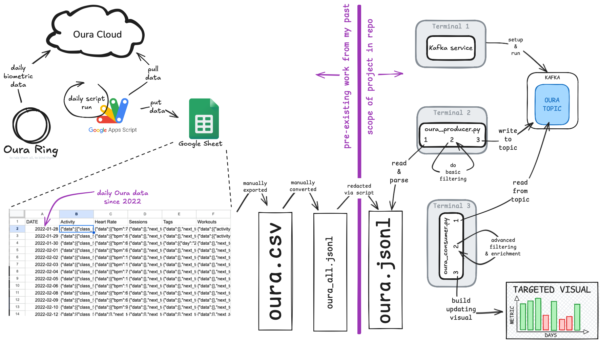

# NW Missouri State University CSIS 44671 Final Module

Date: 2025-09-30
Author: Aaron Gillespie
GitHub: https://github.com/aarongilly

## About 

This repo is the final project for Northwest Missouri State University CSIS 44671 - Streaming Data. It will take place over the course of a couple weeks, which as of this sentence I am just at the start of.

> [!NOTE]  
> This is a demo project featuring Kafka, Data producer (reading `JSONL` as though it were a stream), data cosumers, and auto-updating visualizations.

This project will be focused around **my own personal biometric data** collected from my [Oura Ring](https://ouraring.com/) over the past ~4 years. I am leveraging data from some pre-existing (outside of this repo) work I've done, using [Google Apps Script](https://developers.google.com/apps-script) with [Oura's API](https://cloud.ouraring.com/v2/docs) to pull my own data to a Google Sheet.



Code from the left half of this diagram is not contained within this repo.

### Pipeline


The CSV file is standing in for some sort of on-going, continual data generator. In practice, the `producer` would likely utilize some sort of API (Twitter, Reddit) or in situ data source (manufacturing machine, health monitor). For the sake of simplicity we will substitute JSON utilizing data that *very well could have* come from a data stream - data from my Oura Ring. The `consumer` is operating like a typical consumer would, although its functionality is (intentionally) minimal.

#### Input

Input is data gathered from my Oura ring from early 2022 until mid 2025, exported to a `jsonl` file by hand in advance of creating this repo.

> Note: `jsonl` is a file format for streaming json, standing for *[Newline-delimited JSON](https://en.wikipedia.org/wiki/JSON_streaming#JSONL)*.

#### Producer

In this case, the Producer is acting like a simple passthru - converting the JSON file content to Kafka messages. In practice, Producers often process (filter, add features, etc) source data. 

#### Consumer

My Consumer is reading messages from the Kafka topic, then processing them to pull out a few key datapoints, which it then outputs to a continually-updating chart.

#### Output

The final product of the pipeline, for now at least, is a dynamically updating combo chart showing two data points over a rolling 15 day window. 

1. **Calories Burned** - these are estimated [TDEE](https://en.wikipedia.org/wiki/Energy_expenditure), given my body size & activity level
2. **High Activity Time** - the number of minutes each day the ring determined I was in a "high" activity zone


In theory these two data points should show some level of correlation. In cases where there's a discrepancy (high activity time with low calories burn), I would check for anomalies such as "accidentally recorded workout while actually sitting around doing nothing". 

## Running

Running the code necessitates 3 terminals, run simultaneously. Pull up 3 terminals and run the following 3 commands on each in order:

1. start kafka

```bash
chmod +x scripts/prepare_kafka.sh
scripts/prepare_kafka.sh
cd ~/kafka
bin/kafka-server-start.sh config/kraft/server.properties
```

2. start the producer

```zsh
source .venv/bin/activate
python3 -m producers.oura_producer
```

3. start the consumer

```zsh
source .venv/bin/activate
python3 -m consumers.oura_consumer
```


